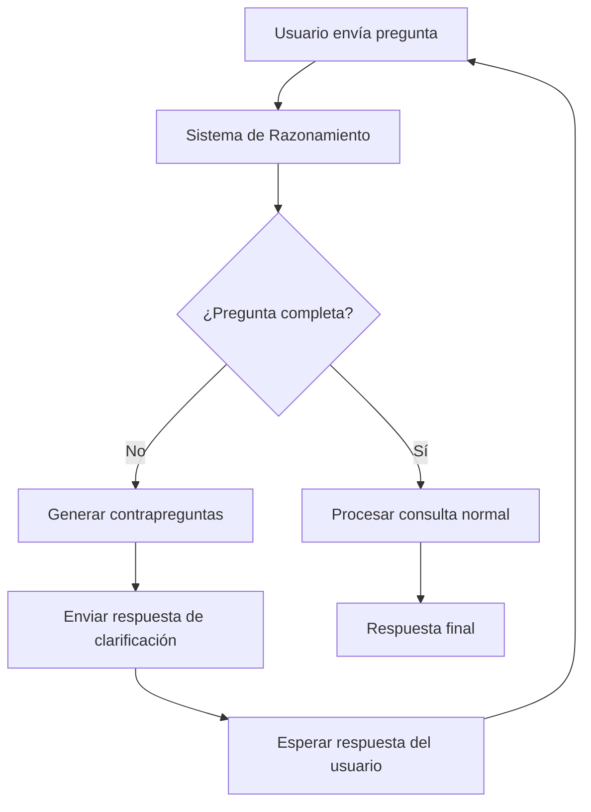

# Sistema de Razonamiento para Chatbot CAMACOL

## 📋 Descripción General

El Sistema de Razonamiento es una nueva funcionalidad implementada en el Chatbot CAMACOL que permite detectar preguntas incompletas o ambiguas y generar contrapreguntas para clarificar la intención del usuario antes de procesar la consulta.

## 🎯 Objetivos

- **Detectar preguntas incompletas**: Identificar cuando una pregunta carece de información esencial
- **Generar contrapreguntas**: Crear preguntas específicas para obtener la información faltante
- **Mejorar precisión**: Asegurar respuestas más acertadas al tener consultas bien definidas
- **Proporcionar razonamiento**: Ofrecer comentarios explicativos sobre por qué se necesita información adicional

## 🏗️ Arquitectura del Sistema

### Componentes Principales

1. **ReasoningSystem**: Clase principal que analiza preguntas y genera respuestas de clarificación
2. **QuestionType**: Enumeración que clasifica tipos de preguntas (completa, incompleta, ambigua, necesita clarificación)
3. **ReasoningResult**: Estructura de datos que contiene el resultado del análisis
4. **analyze_and_respond**: Función de utilidad para integración fácil

### Elementos Esenciales Detectados

El sistema identifica la presencia/ausencia de estos elementos clave:

- **Ubicación**: Ciudad, departamento, región (ej: Bogotá, Cundinamarca, Antioquia)
- **Métrica**: Qué se quiere medir (unidades, valor, área, precio)
- **Período temporal**: Cuándo (año 2024, octubre 2025, trimestre)
- **Tipo de vivienda**: VIS, VIP, No VIS, oficinas, comercial
- **Operación**: Qué hacer (suma, promedio, cantidad, listado)
- **Tipo de cuenta**: Ventas, entregas, licencias, proceso

## 📊 Ejemplos de Funcionamiento

### Preguntas Incompletas → Contrapreguntas

| Pregunta Original | Elementos Faltantes | Contrapreguntas Generadas |
|-------------------|-------------------|---------------------------|
| "¿Cuántas unidades?" | Ubicación, tipo, período | "¿En qué ciudad o departamento te interesa consultar?" |
| "¿Cuál es el precio?" | Ubicación, tipo vivienda | "¿Qué información específica necesitas: precio promedio, valor total?" |
| "Dame datos de construcción" | Métrica, ubicación, período | "¿Qué tipo de datos: unidades, área, valores económicos?" |

### Preguntas con Razonamiento Específico

Basado en los ejemplos proporcionados y experiencia práctica:

| Pregunta | Comentario de Razonamiento |
|----------|---------------------------|
| "¿Cuántas unidades se han vendido en Cundinamarca?" | Se debe especificar la cuenta de ventas, así como asegurar los filtros para trabajar con viviendas |
| "¿Cuál es el precio promedio de una unidad con estrato 6 en Bogotá?" | Se debe especificar la cuenta de ventas, así como asegurar los filtros para trabajar con viviendas |
| "Liste las constructoras y la suma total del área construida para 2024" | Se debe especificar a qué se refiere con área construída, entiendo que es el total de área entregada |
| "¿Cuál es el valor mínimo y máximo de una unidad NO VIS?" | La base trabaja con agregados, es decir, la columna valor incluye el valor de varias unidades |
| "¿Cuántos proyectos hay en Bogotá?" | 🚨 CRÍTICO: Usar COUNT(DISTINCT identificador) porque un mismo proyecto puede aparecer varias veces |
| "¿Cuántas licencias se otorgaron?" | 📋 IMPORTANTE: En LIVO se trabaja con proyectos de construcción, no con licencias |
| "¿Cuáles son las constructoras con más proyectos?" | 🏢 CRÍTICO: Usar NIT junto con nombre de constructora para identificación única |
| "Ranking de empresas por área total" | ⚠️ Solo el nombre puede ser ambiguo, el NIT es el identificador único real |
| "¿Cuántas unidades VIS por política de vivienda?" | 📋 Variable incorrecta: usar segmento_pre o rangos_decreto_pre |
| "¿Cuál es el estado vendido de proyectos?" | ⚠️ No existe estado 'vendido', usar TVE/TE (Terminado vendido y entregado) |
| "Muestra casas en fase de entrega" | 📋 No existe fase 'entrega', usar cuenta 'entregadas' |
| "¿Cuánto valor de mercado en doce meses?" | 💡 Definir qué es valor de mercado + explicar variable doce_meses |

## 🔧 Integración en las Interfaces

### Streamlit (app.py)

```python
# PASO 0: VERIFICAR SI LA PREGUNTA NECESITA CLARIFICACIÓN
if REASONING_AVAILABLE and hasattr(st.session_state, 'reasoning_system'):
    needs_clarification, clarification_response = analyze_and_respond(prompt, st.session_state.reasoning_system)
    
    if needs_clarification:
        st.markdown(clarification_response)
        st.session_state.messages.append({"role": "assistant", "content": clarification_response})
        guardar_historial()
        st.stop()  # Detener hasta obtener más información
```

### Telegram (bot_telegram.py)

```python
# PASO 1: VERIFICAR SI LA PREGUNTA NECESITA CLARIFICACIÓN
if REASONING_AVAILABLE and reasoning_system:
    needs_clarification, clarification_response = analyze_and_respond(user_message, reasoning_system)
    
    if needs_clarification:
        await update.message.reply_text(clarification_response)
        return  # Detener procesamiento
```

## 📝 Patrones de Detección

### Preguntas Incompletas (Regex)
- `^(cuánto|cuánta|cuántos|cuántas)\s*\?*$` - Solo "cuánto?"
- `^(dime|muestra|dame)\s*\?*$` - Solo "dime"
- `^(qué|que)\s*\?*$` - Solo "qué?"
- `^(precio|valor|costo)\s*\?*$` - Solo "precio"

### Clasificación por Elementos Faltantes
- **Incompleta**: > 3 elementos esenciales faltantes
- **Necesita clarificación**: 2-3 elementos faltantes
- **Ambigua**: Falta 1 elemento crítico (métrica u operación)
- **Completa**: Todos los elementos esenciales presentes

## 🎨 Formato de Respuesta de Clarificación

```markdown
🤔 **Necesito más información para ayudarte mejor:**

**Preguntas para clarificar:**
1. ¿En qué ciudad o departamento te interesa consultar la información?
2. ¿Qué información específica necesitas: número de unidades, valor total, área construida?

**Consideraciones importantes:**
• Se debe especificar la cuenta de ventas, así como asegurar los filtros para trabajar con viviendas
• La base trabaja con agregados, si quieres el valor de una sola unidad debe dividirse por el número de unidades

**Por favor especifica:**
• Ubicación geográfica (ciudad, departamento o región)
• Métrica a consultar (unidades, valor, área, etc.)

💡 *Una vez que me proporciones esta información, podré darte una respuesta más precisa y útil.*
```

## 🧪 Pruebas y Validación

### Script de Prueba
Ejecutar `test_reasoning.py` para validar el funcionamiento:

```bash
python test_reasoning.py
```

### Casos de Prueba Incluidos
1. **Preguntas incompletas básicas**
2. **Preguntas que necesitan especificación**
3. **Preguntas más completas pero ambiguas**
4. **Ejemplos específicos de LIVO con comentarios esperados**

## 🔢 Consideraciones Críticas para COUNT en LIVO

### Uso Obligatorio de COUNT DISTINCT
El sistema detecta automáticamente operaciones de conteo y advierte sobre:

- **Proyectos duplicados**: Un mismo proyecto puede aparecer múltiples veces en diferentes registros
- **Identificador único**: Siempre usar `COUNT(DISTINCT identificador)` para contar proyectos únicos
- **Terminología correcta**: LIVO trabaja con "proyectos de construcción", no "licencias"

### Ejemplos de Detección Automática

| Pregunta | Detección | Comentario Generado |
|----------|-----------|-------------------|
| "¿Cuántos proyectos hay en Bogotá?" | Operación COUNT | 🚨 CRÍTICO: Usar COUNT(DISTINCT identificador) |
| "¿Cuántas construcciones VIS?" | Operación COUNT | ⚠️ Un mismo proyecto puede aparecer múltiples veces |
| "Dame la cantidad de licencias" | COUNT + "licencias" | 📋 En LIVO se trabaja con proyectos de construcción |

## 🏢 Consideraciones Críticas para Constructoras y NIT

### Identificación Única de Constructoras
El sistema detecta automáticamente consultas sobre constructoras y advierte sobre:

- **Nombres duplicados**: Pueden existir constructoras con nombres similares o idénticos
- **NIT como identificador único**: El NIT es el verdadero identificador único de cada empresa
- **Constructoras sin NIT**: Algunas pueden aparecer con nombre pero sin NIT en los registros
- **GROUP BY correcto**: Usar tanto NIT como nombre para agrupaciones precisas

### Ejemplos de Detección Automática

| Pregunta | Detección | Comentario Generado |
|----------|-----------|-------------------|
| "¿Cuáles son las constructoras con más proyectos?" | Menciona "constructoras" | 🏢 CRÍTICO: Usar NIT junto con nombre de constructora |
| "Ranking de empresas por área total" | Menciona "empresas" | ⚠️ Solo el nombre puede ser ambiguo, el NIT es el identificador único |
| "Liste las constructoras y su valor de ventas" | Constructoras + GROUP BY | 💡 RECOMENDACIÓN: GROUP BY NIT_constructora, nombre_constructora |

### Recomendaciones SQL para Constructoras

```sql
-- ❌ INCORRECTO: Solo por nombre (puede haber duplicados)
SELECT nombre_constructora, SUM(valor) 
FROM LIVO 
GROUP BY nombre_constructora;

-- ✅ CORRECTO: Por NIT y nombre (identificación única)
SELECT NIT_constructora, nombre_constructora, SUM(valor) 
FROM LIVO 
WHERE NIT_constructora IS NOT NULL
GROUP BY NIT_constructora, nombre_constructora;

-- ✅ ALTERNATIVA: Considerar registros sin NIT por separado
SELECT 
    CASE 
        WHEN NIT_constructora IS NOT NULL THEN NIT_constructora 
        ELSE 'SIN_NIT_' || nombre_constructora 
    END as identificador_unico,
    nombre_constructora,
    SUM(valor) as valor_total
FROM LIVO 
GROUP BY NIT_constructora, nombre_constructora;
```

## 📋 Patrones Detallados de Razonamiento LIVO

### Variables Incorrectas o Inexistentes

El sistema detecta automáticamente variables que no existen o son incorrectas:

| Variable Mencionada | Problema | Corrección Sugerida |
|-------------------|----------|-------------------|
| `política_vivienda` | Variable incorrecta para segmentación | Usar `segmento_pre` o `rangos_decreto_pre` |
| `estado = "vendido"` | Estado inexistente | Usar `TVE` (Terminado vendido y entregado) o `TE` |
| `fase = "entrega"` | Fase inexistente | Usar cuenta `"entregadas"` |
| `destino_etapa = "vivienda"` | Destino inexistente | Usar `uso_etapa = "casa"` y `"apartamento"` |
| `ventas_anuales` | Variable inexistente | Construir desde cuenta de ventas |
| `"casas"` (plural) | Formato incorrecto | Usar `"Casa"` (singular, sin s) |

### Consideraciones sobre Períodos y Fechas

| Término | Explicación | Consideración Técnica |
|---------|-------------|---------------------|
| `doce_meses` | 12 meses anteriores al último mes disponible | Si corte es octubre 2025, doce_meses="2025" para nov 2024-oct 2025 |
| `año_corrido` | Año actual hasta el mes de corte | No usar directamente, extraer año de fecha |
| `2024`, `2025` | Años específicos | Extraer primeros 4 números de fecha o convertir formato |
| Formato fecha | Fecha numérica original | Formato: 20251101 (YYYYMMDD) |

### Variables Existentes que Requieren Consideración

| Variable | Consideración | Recomendación |
|----------|---------------|---------------|
| `precio_mc_promedio` | Ya existe con consideraciones específicas | Confirmar si usar esta variable |
| `valor` | Está en miles en la base | Considerar unidades al mostrar resultados |
| `area` | Agregada para todas las unidades | Para área individual usar `rango_area` |
| `barrio` | No disponible en todas las ciudades | Advertir sobre cobertura limitada |

### Consideraciones Residencial vs No Residencial

El sistema detecta cuando no se especifica el tipo de construcción:

- **Filtros residenciales**: `uso_etapa IN ('Casa', 'Apartamento')`
- **Filtros no residenciales**: Oficinas, comercial, industrial, etc.
- **Recomendación**: Siempre especificar el tipo para evitar ambigüedad

### Agregaciones y Cálculos Especiales

| Caso | Problema | Solución |
|------|----------|----------|
| Valor por unidad | `valor` incluye múltiples unidades | Dividir `valor / unidades` |
| Área individual | `area` es agregada | Usar `rango_area` para filtros individuales |
| Conteo de proyectos | Duplicados posibles | `COUNT(DISTINCT identificador)` |
| Agrupación por constructora | Nombres duplicados | `GROUP BY NIT_constructora, nombre_constructora` |

### Definiciones que Requieren Clarificación

El sistema solicita clarificación para términos ambiguos:

- **"Valor de mercado"**: ¿Ventas, lanzamientos, entregas?
- **"Área construida"**: ¿Área vendida, entregada, aprobada?
- **"Proyectos activos"**: ¿En construcción, aprobados, iniciados?
- **Sin período especificado**: Recomienda definir período para no usar todo el histórico

## 🏗️ Jerarquías y Relaciones en LIVO

### Jerarquía Geográfica

El sistema reconoce y aplica la jerarquía geográfica de LIVO:

```
Regional → Departamento → Ciudad → Zona → Barrio
```

| Nivel Geográfico | Contiene | Instrucción para Agrupación |
|------------------|----------|---------------------------|
| **Regional** | Varios departamentos | Si se filtra por regional, agrupar por departamento o ciudad |
| **Departamento** | Varias ciudades | Si se filtra por departamento, agrupar por ciudad o zona |
| **Ciudad** | Varias zonas | Si se filtra por ciudad, agrupar por barrio para ver detalle |
| **Zona** | Varios barrios | Nivel más detallado de agrupación urbana |
| **Barrio** | Nivel más específico | Máximo detalle geográfico disponible |

### Identificadores Únicos (Claves Primarias)

| Campo | Tipo | Uso Recomendado | Instrucción |
|-------|------|----------------|-------------|
| `nit_constructora` | Constructora | Agrupación por empresa | "nit_constructora es el identificador único de la constructora, use esta columna para agrupar por empresa" |
| `divipola` | Geográfico | Identificación única de municipios | "divipola es el código único de identificación geográfica" |
| `identificador` | Proyecto | Conteo de proyectos únicos | "identificador es único por proyecto, usar COUNT(DISTINCT identificador) para contar proyectos únicos" |

### Orden Cronológico de Estados

El sistema entiende la secuencia lógica de los proyectos:

#### Fases (Nivel General)
```
Preventa → Licencia → Construcción → Terminado
```

#### Estados (Nivel Específico)
```
Aprobada → Vendido → Entregado → Proceso
```

#### Relación Fase-Estado
- **La fase es más general que el estado**
- **Orden típico**: `Preventa` (fase) → `Licencia` (estado) → `Vendido` (estado)
- **Corrección importante**: En LIVO trabajamos con **proyectos de construcción**, no con licencias como entidad independiente

### Ejemplos de Aplicación

| Consulta | Jerarquía Aplicada | Recomendación del Sistema |
|----------|-------------------|--------------------------|
| "Unidades en Bogotá" | Geográfica: Ciudad | 🗺️ Si se filtra por ciudad, agrupar por barrio para detalle |
| "Proyectos por departamento" | Geográfica: Departamento | 🗺️ Si se filtra por departamento, agrupar por ciudad o zona |
| "Constructoras agrupadas" | Identificador: NIT | 🔑 Usar nit_constructora como clave primaria |
| "Conteo de proyectos" | Identificador: Proyecto | 🔑 Usar COUNT(DISTINCT identificador) |
| "Secuencia de fases" | Cronológica: Estados | 📊 Orden: Preventa → Licencia → Vendido |

## 📈 Beneficios del Sistema

### Para el Usuario
- **Respuestas más precisas**: Al clarificar la intención, las respuestas son más acertadas
- **Guía educativa**: Aprende qué información es necesaria para consultas efectivas
- **Experiencia mejorada**: Interacción más natural y conversacional
- **SQL correcto**: Evita errores comunes como contar duplicados

### Para el Sistema
- **Reducción de errores**: Menos consultas mal interpretadas
- **Optimización de recursos**: Evita procesamiento innecesario de consultas ambiguas
- **Mejor calidad de datos**: Asegura que las consultas SQL sean más específicas y útiles
- **Integridad de datos**: Garantiza conteos únicos y precisos

## 🔄 Flujo de Procesamiento



## 🚀 Implementación Técnica

### Archivos Modificados
- `reasoning_system.py` - **NUEVO**: Sistema completo de razonamiento
- `app.py` - Integración en Streamlit
- `bot_telegram.py` - Integración en Telegram
- `test_reasoning.py` - **NUEVO**: Script de pruebas

### Dependencias
- No requiere librerías adicionales
- Utiliza solo bibliotecas estándar de Python
- Compatible con el sistema existente

## 📚 Configuración y Uso

### Activación Automática
El sistema se activa automáticamente si está disponible:
- `REASONING_AVAILABLE = True` cuando se importa correctamente
- Se inicializa en `st.session_state.reasoning_system` (Streamlit)
- Se inicializa como `reasoning_system` global (Telegram)

### Personalización
Los patrones y respuestas pueden personalizarse modificando:
- `essential_elements`: Elementos esenciales a detectar
- `counter_questions_templates`: Plantillas de contrapreguntas
- `reasoning_comments`: Comentarios específicos de razonamiento

## 🔮 Futuras Mejoras

1. **Aprendizaje adaptativo**: Mejorar patrones basado en interacciones
2. **Contexto conversacional**: Recordar información de mensajes anteriores
3. **Integración con ML**: Usar modelos de clasificación más sofisticados
4. **Métricas de efectividad**: Medir mejora en precisión de respuestas

## 📞 Soporte

Para dudas o mejoras del sistema de razonamiento:
- Revisar logs de `print()` en consola para debugging
- Ejecutar `test_reasoning.py` para validar funcionamiento
- Verificar que `REASONING_AVAILABLE = True` en ambas interfaces
